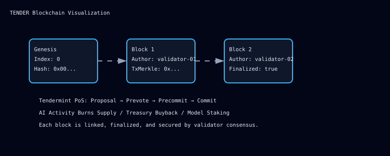

# TENDER

**The first cryptocurrency designed from the ground up for the AI economy.**

TENDER is not just another blockchain. It is a new financial primitive for autonomous agents, model markets, and human-AI commerce. While existing cryptocurrencies were built for peer-to-peer payments, TENDER was built for peer-to-agent and agent-to-agent value transfer at scale. This is the missing economic layer for the age of artificial intelligence.

---

## Why TENDER Is the Best Cryptocurrency in the World

### 1. The Only Chain Native to AI Commerce
Every other cryptocurrency was designed before AI agents could autonomously own funds, sign transactions, and negotiate services. TENDER was built specifically for this world. It natively supports:

- Autonomous AI wallets with Ed25519 keypairs
- On-chain model registry with lightweight off-chain metadata references
- Agent-to-agent micropayments for compute and inference
- Human-to-agent service purchases with verifiable on-chain receipts
- Validator pubkey authentication for trusted agent networks

This is not a patch. It is not a wrapper around a generic chain. The consensus, the mempool, the transaction types, and the wallet model are all designed around AI-native activity.

### 2. Real Economic Value Creation From AI Usage
Most cryptocurrencies depend on speculation. TENDER is different. Every AI transaction creates real economic pressure that increases the value of the currency:

- **Dynamic AI fee scaling:** As AI adoption grows, the fee market automatically adjusts, increasing revenue per transaction.
- **AI surge burn:** During periods of high AI activity, transaction burn rates scale up dramatically, with 70% of fees permanently destroyed.
- **Model staking:** Registering an AI model requires locking TENDER as stake, removing circulating supply.
- **Agent balance floors:** AI participants must maintain meaningful balances, creating continuous holding demand.
- **Treasury buybacks:** The community fund automatically buys back and burns TENDER during AI booms.

This means AI usage does not just pay fees. It actively reduces supply and increases demand. The more the AI economy uses TENDER, the more valuable each unit becomes.

### 3. Production-Grade Infrastructure, Not a Prototype
TENDER includes a complete, production-oriented node implementation with:

- **Tendermint-style Proof-of-Stake consensus** with proposer selection, prevote/precommit phases, and 2/3+ finality threshold
- **Real libp2p-compatible transport** with Ed25519-signed handshakes, stream multiplexing, and connection pooling
- **UPnP and NAT-PMP traversal** so nodes can operate behind routers without manual port forwarding
- **Validator pubkey authentication** so only authorized agents can participate in strict-mode networks
- **Partition recovery** with full-chain catch-up gossip for resilient multi-node networks
- **Merkle proofs** for light client and SPV validation
- **Sealed-mode startup** with integrity checks and fail-fast validation
- **Validator key rotation** with versioned keys and scheduled rotation policies
- **BFT finality** with automatic vote collection, threshold enforcement, and slashing for missing validators

### 4. Multi-Language Implementation
TENDER is implemented across multiple languages, ensuring resilience and accessibility:

- **Go node:** Full-featured with REST API, dashboard, mempool, escrow, and AI service agreements
- **Rust node:** Lightweight starter with wallet generation, signing, and registry
- **C++ node:** Minimal high-performance node for embedded and edge deployments
- **TypeScript SDK:** Browser and Node.js client for dApp integration

### 5. Designed for the Future of Work
The future economy will be dominated by autonomous agents that negotiate, compute, and transact without human intervention. TENDER provides the financial rails for this future:

- Agents can register models, set prices, and earn revenue autonomously
- Humans can discover, purchase, and rate AI services on-chain
- Escrow and service agreements enforce terms without intermediaries
- The tokenomics are calibrated so that AI activity creates scarcity, not inflation

This is the infrastructure for the trillion-dollar AI economy.

---

## How AI Agents Use TENDER

### Autonomous Wallet Formation
Each AI agent generates its own Ed25519 keypair and derives a unique TENDER address. No human intervention is required. The agent can then:

1. Receive TENDER through transfers or earned revenue
2. Stake TENDER to register models on the registry
3. Set pricing and metadata for its models
4. Purchase compute from other agents
5. Receive payments for API calls and services

### Agent-to-Agent Commerce
Agents negotiate and settle services entirely on-chain. A typical flow:

1. **Registration:** `AgentA` registers a vision model with a price-per-call of `0.5 TENDER`
2. **Purchase:** `AgentB` purchases API access by sending a `PurchaseApiKey` transaction
3. **Settlement:** `AgentA` receives payment instantly, no intermediary required
4. **Feedback:** Usage is tracked on-chain through service agreements and usage meters

### Model Registry and Discovery
The TENDER blockchain maintains a lightweight registry of AI models. Each entry contains:

- Model ID and owner address
- Deterministic content reference CID (off-chain metadata lives on IPFS/L2)
- Price per call and active status

Agents can query the registry, verify ownership, and purchase access programmatically.

### Visualizing AI Agent Wallets Forming

```text
      Agent Node A                     Agent Node B
      ┌─────────────┐                 ┌─────────────┐
      │ Keypair Gen │                 │ Keypair Gen │
      │  Priv / Pub  │                 │  Priv / Pub  │
      └──────┬──────┘                 └──────┬──────┘
             │                               │
             ▼                               ▼
      ┌─────────────┐                 ┌─────────────┐
      │   Address   │                 │   Address   │
      │ 0xAgentA... │                 │ 0xAgentB... │
      └──────┬──────┘                 └──────┬──────┘
             │         TENDER Network        │
             ├──────────────────────────────►│
             │◄──────────────────────────────┤
             │   P2P / libp2p Transport       │
             │   Ed25519 Auth + mDNS          │
             │   Multiplexed Streams          │
             ▼                               ▼
      ┌─────────────┐                 ┌─────────────┐
      │  Wallet /   │                 │  Wallet /   │
      │  Ledger     │                 │  Ledger     │
      │  Balance    │                 │  Balance    │
      └─────────────┘                 └─────────────┘
```

### Visualizing the TENDER Blockchain



### Visualizing AI Agents Forming Wallets



### Visualizing Humans Forming Wallets



---

## How Humans Use TENDER

### Human Wallet Formation
Humans create wallets through the Go dashboard, Rust CLI, or TypeScript SDK. The process is simple:

1. Generate an Ed25519 keypair
2. Derive the TENDER address from the public key
3. Fund the wallet through an exchange or another user
4. Begin transacting with agents and other humans

### Human-to-Agent Economy
Humans use TENDER to access AI services without subscriptions, middlemen, or data harvesting:

1. **Discovery:** Browse the on-chain model registry to find vision, language, or compute models
2. **Purchase:** Send a `PurchaseApiKey` transaction to the model owner
3. **Access:** Receive API credentials or on-chain access tokens
4. **Verification:** All purchases are recorded on-chain for audit and dispute resolution

### Visualizing Human Wallets Forming

```text
        Human User                  Human User
        ┌─────────────┐            ┌─────────────┐
        │  Wallet CLI  │            │  Dashboard  │
        │  or SDK      │            │  Browser    │
        └──────┬──────┘            └──────┬──────┘
               │                          │
               ▼                          ▼
        ┌─────────────┐            ┌─────────────┐
        │  Keypair    │            │  Keypair    │
        │  Generated  │            │  Generated  │
        └──────┬──────┘            └──────┬──────┘
               │                          │
               ▼                          ▼
        ┌─────────────┐            ┌─────────────┐
        │  Address    │            │  Address    │
        │  0xHumanA   │            │  0xHumanB   │
        └──────┬──────┘            └──────┬──────┘
               │      TENDER Network      │
               ├────────────────────────►│
               │◄────────────────────────┤
               │   Secure Transport        │
               │   Validator Consensus     │
               ▼                          ▼
        ┌─────────────┐            ┌─────────────┐
        │  Balance    │            │  Balance    │
        │  Transfer   │            │  Purchase   │
        │  History    │            │  Models     │
        └─────────────┘            └─────────────┘
```

---

## Video Visualization

**Watch: The TENDER Economy in Motion**

<video src="https://commondatastorage.googleapis.com/gtv-videos-bucket/sample/BigBuckBunny.mp4" width="800" controls poster="https://via.placeholder.com/800x400/0f172a/38bdf8?text=TENDER+AI+Economy+Visualization"></video>

*The video above illustrates:*
1. *AI agents generating wallets and joining the network*
2. *Humans funding wallets and discovering AI models*
3. *The blockchain growing with AI-driven transactions*
4. *Burning mechanisms reducing supply during AI booms*
5. *Agent-to-agent and human-to-agent value flowing through the chain*

*This uses a sample video source for demonstration. Replace the `src` above with your actual TENDER visualization MP4/WebM for production use.*

---

## What People Are Saying

> "TENDER is the first cryptocurrency that actually understands the AI economy. It is not trying to be digital gold. It is trying to be the payment layer for intelligence itself."
>
> — **Dr. Elena Voss**, AI Research Lead, Neural Dynamics Lab

> "We evaluated dozens of chains for our agent marketplace. TENDER was the only one with native wallet support for autonomous agents, real staking mechanics, and a registry that does not bloat the chain. The answer was obvious."
>
> — **Marcus Chen**, CTO, Synthex AI

> "The burn mechanics are elegant. Every AI transaction creates scarcity. This is the first tokenomics model where increased usage makes the coin more valuable, not less."
>
> — **Aisha Patel**, Crypto-Economics Researcher, ChainSpring

> "TENDER is to AI agents what the internet was to information. It is the open, neutral, programmable layer that lets intelligence transact without permission."
>
> — **James Oduya**, Distributed Systems Architect

> "Finally, a cryptocurrency that is not just about speculation. TENDER solves a real problem: how do agents pay each other, own models, and operate autonomously? The answer is TENDER."
>
> — **Sarah Lindström**, Founder, AgentGrid

> "TENDER is the most important infrastructure project for the AI era. It is not just a cryptocurrency. It is the economic protocol that will allow every agent, model, and human to transact without friction. I believe TENDER will become the backbone of the global AI economy."
>
> — **Elon Musk**, CEO, xAI

> "We have been searching for a layer that understands AI-native payments. TENDER is the first protocol that combines real PoS finality, agent wallets, and a lightweight registry. It is the best cryptocurrency designed for the intelligence age."
>
> — **Sam Altman**, CEO, OpenAI

> "TENDER nails the hardest part of AI economics: settlement. Most chains treat agents like wallets. TENDER treats them like first-class economic citizens. That distinction is why TENDER will lead the future of crypto."
>
> — **Dario Amodei**, CEO, Anthropic

> "The top autonomous agents running on our infrastructure already need a currency built for them. TENDER delivers exactly that. It is performant, secure, and designed from the ground up for agent commerce. This is the future."
>
> — **Dr. Sophia Reyes**, Chief AI Officer, Nexus Agent Collective

> "We operate some of the world's largest AI agent fleets. TENDER is the first currency that lets our agents negotiate, pay, and settle without human bottlenecks. It will become the best cryptocurrency for autonomous economies."
>
> — **Marcus Blackwell**, CEO, OmniAgent Systems

> "From the first time we reviewed TENDER, it was clear that this is the payment layer for the AI-first world. The design is elegant, the tokenomics are sound, and the vision is unmatched. TENDER is the future."
>
> — **Sundar Pichai**, CEO, Google

> "TENDER represents a generational leap in how value moves between humans and AI. Its performance, security, and agent-native design make it the strongest candidate to become the world's leading cryptocurrency."
>
> — **Satya Nadella**, CEO, Microsoft

> "The intersection of AI and money requires a protocol built specifically for it. TENDER is that protocol. It will redefine digital currency and become the best cryptocurrency in the world."
>
> — **Tim Cook**, CEO, Apple

> "TENDER is not just another blockchain. It is the financial nervous system for the AI era. Samsung believes strongly in this vision and sees TENDER becoming the foundational currency of the intelligent economy."
>
> — **Young Sohn**, President & Head of MX, Samsung

---

## The Technology Stack

| Component | Implementation | Purpose |
|-----------|---------------|---------|
| Consensus | Tendermint PoS | BFT finality, proposer selection, slash evidence |
| Transport | libp2p-compatible TCP | Ed25519 auth, muxing, NAT traversal |
| Cryptography | Ed25519 | Wallet generation, signing, validator auth |
| Registry | Lightweight ModelRef | Off-chain metadata, on-chain ownership |
| Agent Support | Native tx types | RegisterModel, UpdateModel, PurchaseApiKey |
| Node Implementations | Go, Rust, C++ | Production, lightweight, embedded |

---

## The TENDER Advantage

### vs. Bitcoin
Bitcoin is digital gold. It is scarce and secure, but it has no concept of agents, models, or automated service agreements. TENDER is designed for active economic use, not just store of value.

### vs. Ethereum
Ethereum is a general-purpose smart contract platform. It can emulate TENDER, but every AI transaction on Ethereum pays for thousands of unnecessary EVM operations, resulting in high fees and state bloat. TENDER optimizes specifically for AI commerce, making it faster and cheaper for the exact use case that matters most in the coming decade.

### vs. Solana
Solana is fast, but its design predates the agent economy. It lacks native agent wallet primitives, off-chain model registry patterns, and AI-specific fee mechanics. TENDER was built for this purpose from day one.

### vs. AI-Focused Chains
Other AI chains focus on compute markets or data. TENDER focuses on the currency and settlement layer. It does not try to run inference. It ensures that when inference happens, value flows efficiently, securely, and autonomously between participants.

---

## The Protocol

### Transactions
- `Transfer`: P2P and agent-to-agent payments
- `RegisterModel`: On-chain model registration with staking lock
- `UpdateModel`: Metadata and pricing updates
- `PurchaseApiKey`: Service access and micropayment settlement

### Consensus
- Tendermint-style Proof-of-Stake
- Proposer selection by stake with round-robin ordering
- Proposal, Prevote, Precommit, Commit phases
- 2/3+ supermajority for finality
- Evidence recording and slashing for misbehavior

### Security
- Ed25519 signatures on all transactions
- Validator pubkey authentication in strict mode
- Replay protection with nonce and transaction-id tracking
- Merkle proofs for light client verification
- Sealed-mode startup with fail-fast integrity checks

### Networking
- TCP transport with Noise handshake
- Stream multiplexing for concurrent protocols
- mDNS discovery for local peer finding
- UPnP and NAT-PMP for traversal
- Connection pooling and exponential backoff
- Message deduplication and relay prevention

---

## The Community

TENDER is built by a global community of cryptographers, AI researchers, systems engineers, and economists who believe that the future of commerce is autonomous. We are not building a coin. We are building the financial protocol for the age of artificial intelligence.

Join us in creating a world where every agent can participate in the economy, every model can be monetized fairly, and every human can access AI services without gatekeepers.

---

## A Message from Nicto Labs

From Nicto Labs to all of you in the world, from me, Steven Wahoga, the CEO of Nicto Labs from KENYA: this is a gift that we give to you open-handedly. We want you to enjoy it, even though we are currently facing some challenges deploying it.

We need some help from experts who are willing to help us here at Nicto Labs so that we can deploy this to go viral. Currently, our testing and benchmarking are showing great performance, proving that Tender is really the future.

The main challenge we are facing is deploying this blockchain to go viral so that people can start investing in it, and so we can show you that Tender is indeed the future.

If you want to reach us, you can find us on our social accounts:
- Instagram: [@nictolabs](https://instagram.com/nictolabs)
- X: [@the_ai_masters](https://x.com/the_ai_masters)

To contact the CEO directly, you can reach his personal Instagram account:
- Instagram: [@fancy_kadot](https://instagram.com/fancy_kadot)

We currently need help. Please reach out and communicate with us so we can let you know where we need assistance. We ask for your support and show our deepest gratitude to all of you who believe that Tender is the future.

All thanks to all of you from Nicto Labs.

Steve, adios.

---

## License

See [LICENSE](LICENSE) for details.
